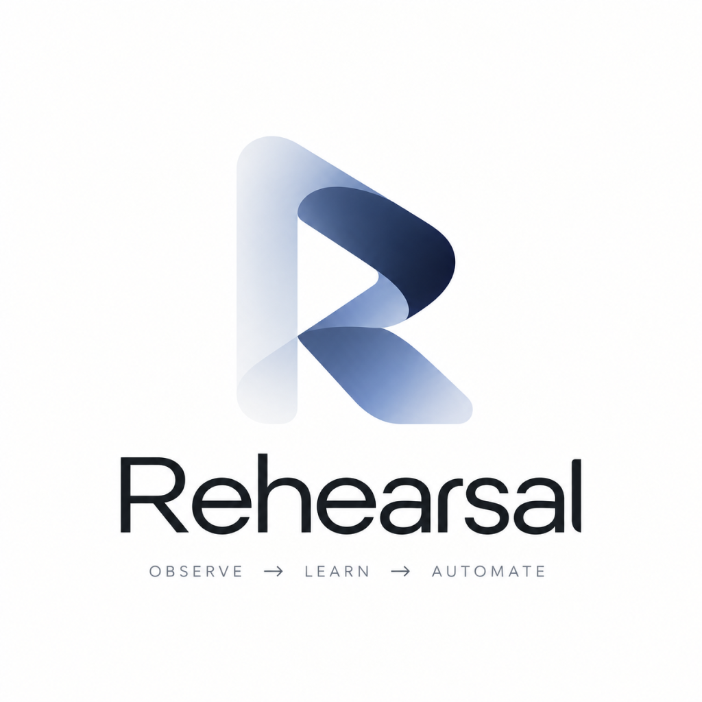

<p align="center"></p>

# Rehearsal

**Show your work twice. Review what happens next.**

Rehearsal learns a support workflow from semantic observations across mail, an issue tracker, and team chat. It explains the pattern, adapts it to an unfamiliar report, and presents a Ghost Run before any consequential action. The complete offline experience works without accounts, API keys, or external requests.

The canonical demonstration teaches two technical reports routed to **Umar**, then correctly routes an unseen duplicate-charge report to **Awaiz** in Billing. An ambiguous report stops for human review. Rehearsal learns **department → owner**, rather than storing the person who happened to handle the examples.

## Run locally

Use **Node.js 24 or newer** and npm. The same commands work in Windows PowerShell, macOS, and Linux.

```sh
git clone --branch feature/rehearsal-complete https://github.com/tehsin-shaik/Multi-App-AI-Agent-Hackathon.git
cd Multi-App-AI-Agent-Hackathon
npm ci
npm run dev
```

Open **http://localhost:3000**. No `.env.local` is needed for the demo. Already cloned? Run `git fetch origin`, then `git switch feature/rehearsal-complete` after saving any work in your current checkout.

1. Open the workspace and start the first observation. Complete the guided actions in Mail, Tracker, and Chat.
2. Teach the second example. One example alone never activates a pattern.
3. Activate the learned workflow and deliver the new billing report.
4. Inspect the Ghost Run: evidence, adapted owner, exact destinations, permission requirements, and proposed messages.
5. Approve the plan. Watch the issue, assignment, notification, and reply receive verified receipts.
6. Try the ambiguous report, resolve its department, and review the revised plan separately.

**Ctrl/Cmd+K** opens commands. **Ctrl/Cmd+Shift+D** opens the demo console. Shortcuts call the same application commands as the manual experience. See the [presentation walkthrough](docs/DEMO.md).

## What is included

- Modern responsive workspace, supplied Rehearsal logo, onboarding, workflow library/detail, interactive React Flow memory map, audit timeline, Ghost Run dialog, privacy controls, and optional live workspace.
- Strict TypeScript domain model, deterministic trace normalization/redaction, latent extraction/classification steps, weighted similarity detection, explicit variable provenance, and six department routing rules.
- An ordered executor with per-plan approval, permission enforcement, real result references, duplicate suppression, failure injection, resumable execution, and receipt-based verification.
- Server-side model adapters for OpenRouter, OpenAI-compatible endpoints, and Gemini; schema/evidence validation; bounded timeouts; deterministic fallback; optional identity-free Exa research.
- Gmail OAuth, GitHub Issues, ClickUp, Jira Cloud, and channel-specific Slack webhook adapters. Optional local services add Gmail IMAP/SMTP and the genuine CopilotKit v2 runtime.
- An opt-in Manifest V3 browser observer with temporary pairing, bounded semantic metadata, pre-storage redaction, and server-side revalidation.
- Automated domain, acceptance, integration, browser, and optional-service checks; read-only GitHub Actions verification; container and optional Cloudflare setup files.

## Verify

```sh
npm run typecheck
npm run lint
npm test
npm run build
npm run verify:copilotkit
```

`npm run check` runs the first four checks together. Browser verification needs Playwright and a running app:

```sh
npm install --no-save --package-lock=false playwright
npx playwright install chromium
npm run test:browser
```

The browser test exercises manual learning, billing adaptation, approval, execution, ambiguity, routes, mobile overflow, and zero external requests. GitHub Actions uploads screenshots as `rehearsal-browser-checks`. See [testing](docs/TESTING.md).

## Routes

| Route | Purpose |
| --- | --- |
| `/` | Product introduction and demo entry |
| `/onboarding` | Observation boundaries and guided setup |
| `/workspace` | Offline Mail / Tracker / Chat workspace |
| `/workflows` | Learned workflows and activation controls |
| `/workflows/support-triage` | Evidence, variables, permissions, graph |
| `/activity` | Observed, inferred, approved, executed, and failed events |
| `/privacy` | Pause, exclusions, clearing history, forgetting evidence |
| `/integrations` | Live setup, session unlock, OAuth, extension pairing |
| `/live` | Real reports, observed traces, server-owned Ghost Runs |

## Live connections

Copy `.env.example` to `.env.local`, configure the services you need, set both demo flags to `false`, and restart/rebuild. Credentials remain server-side. A local access key unlocks an eight-hour session; live writes additionally require approval of the exact server-owned plan. [Integration setup](docs/INTEGRATIONS.md) covers scopes, assignee mappings, channels, extension installation, optional Node services, and troubleshooting.

This is a working single-user application with explicit safety boundaries. It is **not yet a multi-tenant production service**: session state and receipts are held in memory, and real account credentials have not been used during development verification. Restarting a live server requires reconciling uncertain external writes. The Ambiguous adapter deliberately reports unavailable until its vendor contract is verified. See [implementation status](docs/IMPLEMENTATION-STATUS.md) for the exact scope and [deployment](docs/DEPLOYMENT.md) before hosting live credentials.

## Engineering guide

[Architecture](docs/ARCHITECTURE.md) · [Demo script](docs/DEMO.md) · [Privacy](docs/PRIVACY.md) · [Integrations](docs/INTEGRATIONS.md) · [Testing](docs/TESTING.md) · [Deployment](docs/DEPLOYMENT.md) · [Product requirements](docs/REHEARSAL-PRD.md)
