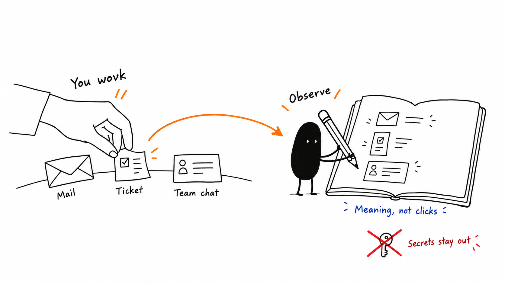
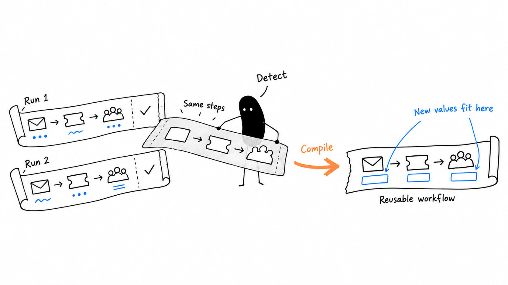
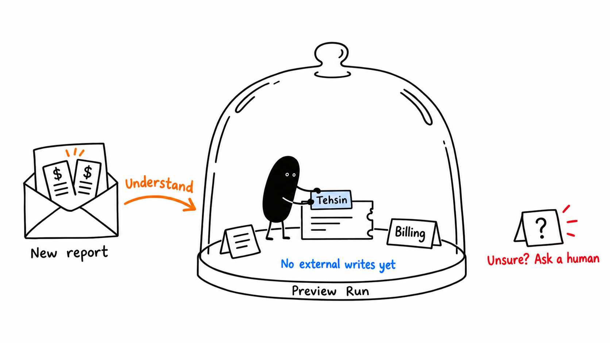
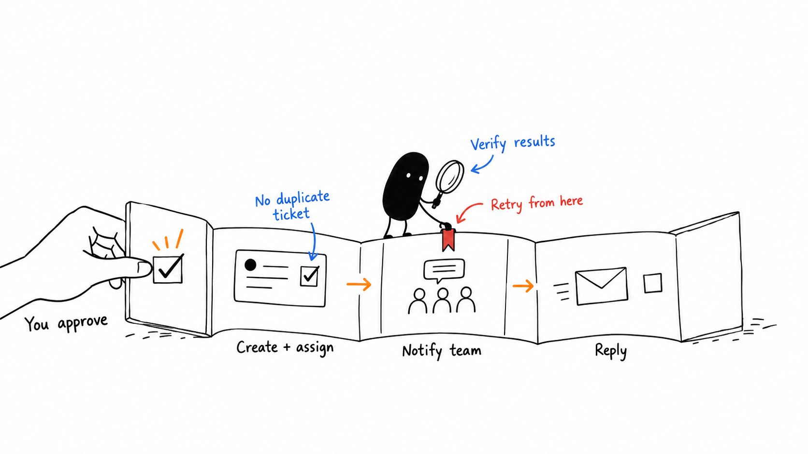

# Rehearsal: how it works

Four English-labelled illustrations, in the requested ian-xiaohei-illustrations style. Generated with the built-in image-generation tool, reviewed visually, and grounded in the Rehearsal repository at commit `a12e008` on 2026-09-22.

**Observe → Detect → Compile → Preview Run → Approve → Execute**

## 1. Observe: teach through work

You perform the supported support-triage work. Rehearsal records normalized semantic events: what the action means, rather than raw mouse positions or keystrokes. Redaction excludes credentials and other sensitive fields. Observation can be paused and applications excluded.

## 2. Detect and compile: turn repetition into a reusable workflow

One observation is not enough. Two sufficiently similar completed traces can reveal a repeated pattern; the default similarity threshold is 0.82. Compilation separates reusable structure from runtime values such as the customer, issue, department and owner. You inspect and activate the resulting workflow.

The three pictograms are a visual shorthand, not a literal stage count. The compiled workflow has five stages: **Email → Understand issue → Create ticket → Assign owner → Notify team**.

## 3. Understand and preview: rehearse the next case

A new report is extracted, classified and routed, and its values are resolved into a Preview Run. The repository's billing example routes **Billing → Tehsin**. The preview proposes ticket creation, ownership, notifications and a customer reply without performing external writes. Unresolved ownership requires human review rather than a guess.

The glass cover represents the no-write preview boundary, not a separate security sandbox. Reads, analysis and drafting may occur before approval.

## 4. Approve, execute and verify: act with a checkpoint

After explicit human approval, the consequential actions run in order: create the issue, assign its owner, notify the team, then reply to the customer. Policy is checked before actions; success is based on adapter-confirmed results. A failure stops later actions and preserves confirmed earlier work. Resuming the illustrated run retries the failed notification without recreating its successful ticket.

The bookmark represents run progress, not durable storage. The prototype does not promise distributed exactly-once delivery or persistence across process restarts.

## Scope and implementation references

These drawings explain the supported workflow, not arbitrary desktop automation. Demo Mode uses local adapters; live integrations require configuration.

- Observation and privacy: [event normalizer](../../src/domain/events/event-normalizer.ts), [redaction](../../src/domain/events/redaction.ts), [privacy notes](../../docs/PRIVACY.md).
- Pattern learning: [detection](../../src/domain/patterns/pattern-detection.ts), [compiler](../../src/domain/patterns/pattern-compiler.ts), [five-stage generation](../../src/domain/patterns/workflow-step-generation.ts).
- Planning and routing: [preview planner](../../src/domain/runs/preview-run-planner.ts), [team routing](../../src/domain/understanding/team-routing.ts).
- Execution and verification: [executor](../../src/application/engine/run-executor.ts), [verifier](../../src/application/engine/run-verifier.ts), [canonical acceptance test](../../tests/acceptance/canonical-workflow.test.ts).

## Asset notes

All four final PNGs are 1672 × 941, approximately 16:9, with opaque white backgrounds and English lettering. All four are intended for use together, in numeric order. The preview illustration received a background-only correction. Original generated files remain untouched in the Codex generated-images directory.

See [PROMPTS.md](PROMPTS.md) for the exact generation prompts and correction prompt. No application code was changed.
