# Rehearsal Architecture

## System Map

```mermaid
flowchart LR
  Work[Supported human work] --> Observer[Semantic observer]
  Observer --> Normalize[Normalize and redact]
  Normalize --> Trace[Workflow traces]
  Trace --> Compare[Weighted pattern comparison]
  Compare --> Compile[Pattern compiler]
  Compile --> Trigger[Active workflow trigger]
  Trigger --> Understand[Deterministic or validated live understanding]
  Understand --> Research[Optional sanitized research]
  Research --> Preview[Preview Run planner]
  Preview --> Policy[Deterministic policy]
  Policy --> Approval{Human approval}
  Approval -->|approved| Execute[Ordered executor]
  Approval -->|not approved| Block[No external changes]
  Execute --> Adapters[Typed demo or live adapters]
  Adapters --> Verify[Adapter results and run verifier]
```



## Dependency Boundaries

### Domain

`src/domain` is framework-independent. It imports no React, Next.js, Zustand, browser API, or external service client.

- `events` defines the semantic taxonomy, deterministic normalization, redaction, latent-step inference, and trace lifecycle.
- `patterns` compares traces, discounts confidence for small samples, compiles generalized fields, records provenance, and creates five workflow stages.
- `understanding` extracts deterministic report structure and applies department-to-owner routing.
- `policy` maps actions to permission classes, computes risk, blocks payments, and enforces approval immediately before execution.
- `runs` resolves variables, detects adaptations, requests review, composes messages, and creates side-effect-free Preview Runs.

### Application

`src/application` coordinates domain operations without owning external credentials.

- `engine` executes actions in order, preserves confirmed results, rewrites predicted issue references, resumes failures, and verifies completion.
- `state-machine` defines every valid transition from `idle` through completion, failure, or cancellation.
- `store` composes engine, workspace, presentation, and integration slices.
- `commands` exposes atomic operations so UI components do not coordinate multi-field state changes.

### Infrastructure

`src/infrastructure` is the side-effect boundary.

- `adapters` implements ClickUp, Jira, GitHub Issues, Ambiguous, Slack, Gmail OAuth, unavailable fail-closed adapters, and deterministic in-memory equivalents under `src/demo`.
- `ai` implements one server-only OpenAI-compatible JSON client with OpenRouter, OpenAI, then Gemini priority.
- `research` builds sanitized Exa queries and runs research concurrently with understanding.
- `agents` exposes structured AG-UI planning events only; approval and execution are not tools.
- `mail` provides bounded read-only IMAP and OAuth-backed Gmail access.
- `observation` independently scrubs and buffers extension events.
- `validation` uses Zod at HTTP and extension-feed boundaries.

### Presentation

`src/app` owns routes and API handlers. `src/components` owns reusable controls, replica surfaces, the Preview Run experience, and the React Flow memory map. Presentation reads state and invokes commands; it does not bypass policy or adapters.

## Behavior-to-Agent Pipeline

1. A semantic event is normalized into deterministic content and identifier values.
2. Credentials, authentication values, payment information, browser mechanics, and excluded applications are removed.
3. Trace construction inserts deterministic issue-extraction and classification events when later work implies them.
4. Pattern detection requires two completed observations and a weighted similarity of at least `0.82`.
5. Compilation classifies fields as variables or held constants, records source-event provenance, and encodes the `department → owner` dependency.
6. A matching unread report is understood, routed, and optionally researched with a sanitized query.
7. The Preview Run resolves ten actions and displays evidence, adaptations, policy, risk, and targets before any write.
8. Human review resolves ambiguous routing. Approval is required for all consequential actions.
9. The executor re-runs policy immediately before each action and trusts success only when the adapter returns `ok: true`.
10. A failure stops later work. Retry resumes at the failed step and preserves idempotent successful work.

## Similarity Model

The comparison score is deterministic:

```text
score = 0.55 × normalized Levenshtein action similarity
      + 0.20 × application-set Jaccard similarity
      + 0.25 × semantic-intent cosine similarity
```

The detector requires two observations, applies a sample-size confidence discount, and exposes progressive confidence while a matching trace develops.

## Generalization Model

The compiler collapses evidence across matching traces and classifies each canonical field by derivation:

- `authored` values remain constants when evidence supports holding them fixed.
- `extracted` customer and issue values become runtime variables.
- `classified` category, department, severity, and labels are derived from each new report.
- `routed` owner values depend on department rather than a copied observed person.
- `generated` issue numbers and outbound message bodies are produced at run time.

Every binding is typed, required where appropriate, and linked to matching trace and source-event identifiers.

## Preview Run Safety

The planner is side-effect free. A Preview Run includes resolved values, ordered actions, literal evidence, optional research references, adaptations, requested permissions, approval state, and target labels. Models may suggest understanding only; they cannot approve, alter policy, or execute.

The execution boundary provides:

- explicit run-state and approval guards;
- a policy check immediately before every action;
- one remote action per `/api/execute` request;
- bounded server-side idempotency results;
- predicted-to-actual issue reference rewriting;
- stop-on-first-failure and resume-without-duplication behavior;
- post-run verification and metrics.

## State and Persistence

Application state is in-memory Zustand state. Presentation preferences use browser local storage. The observation API, timeline, adapter idempotency cache, and extension queues are bounded. Gmail OAuth uses a local ignored `.rehearsal/gmail-oauth-token.json` file for the single-user prototype. No durable multi-user application store is implemented.

## Offline and Live Parity

Demo and live modes share normalization, detection, compilation, understanding contracts, planning, policy, execution, verification, and run presentation. Only adapters and optional enrichment clients change. Demo Mode does not invoke live clients and is verified with a fetch guard that requires zero network requests.
